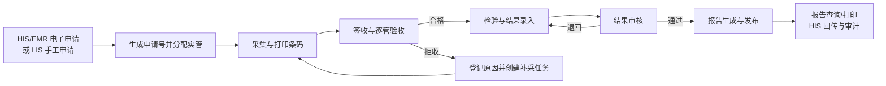

# OpenELIS-CN 临床检验信息系统

OpenELIS-CN 是基于 [OpenELIS Global 2](https://github.com/DIGI-UW/OpenELIS-Global-2) 改造的中国医院临床检验信息系统（LIS）。项目保留 OpenELIS 的检验业务、权限、审计和接口基础，并围绕国内医院常用的“申请—标本—检验—审核—报告”流程重组菜单、页面和操作路径。

> **当前状态：开发试用候选。** `develop` 是当前集成基线，已经完成本机模拟数据下的单管正常闭环和多管部分拒收/补采验证。真实 HIS、真实仪器、医院主数据、报告与标签样张、危急值制度及岗位权限仍须在具体医院现场验收后才能用于生产。

## 产品目标

- 用业务任务组织界面，让检验人员知道当前要做什么、完成条件是什么、下一步去哪里。
- 优先跑通核心流程，减少重复入口、过深菜单、孤立页面和不必要填写。
- 一份检验申请可以关联一根或多根实管，每根管独立采集、签收、验收、拒收和补采。
- 用主数据、角色权限和审计记录约束操作，避免依赖自由文本或直接修改数据库。
- 复用 OpenELIS 现有能力渐进改造，保持升级、扩展和外部系统对接的空间。

## 核心业务流程



系统同时保留两种申请来源：

1. **电子申请**：用于后续接收 HIS/EMR 下发的患者、就诊和检验申请。
2. **LIS 手工申请**：用于单机、应急、补录和本机模拟环境。

## 当前功能范围

| 业务域     | 当前入口与能力                                                                     |
| ---------- | ---------------------------------------------------------------------------------- |
| 工作台     | 今日待办、核心任务数量、常用操作和主流程入口                                       |
| 申请与标本 | 申请列表、手工新建、电子申请接收、批量录入、采集、条码、签收、逐管验收、拒收与补采 |
| 检验       | 待录入结果、结果录入工作台、外送检验、检验工作单                                   |
| 审核与报告 | 结果审核、退回、患者检验报告、报告工作台和业务统计入口                             |
| 质量管理   | 不符合项、质量预警以及与审核流程关联的质量阻断                                     |
| 基础配置   | 检验主数据、规则、机构与人员、流程与报告、仪器与接口、编码及有效期                 |
| 系统管理   | 用户、角色、菜单权限、运行参数、操作日志和系统运维                                 |

病理、细胞学、免疫组化、EQA、库存和区域转运等独立专业域在中国版默认关闭，需要时再按医院范围启用。

## 单管与多管

系统以“申请”和“实管”两个层级管理标本：

- **单管**：一份申请只需要一种标本或一根容器，采集和验收路径最短。
- **多管**：一份申请按项目与标本类型拆成多根实管。例如生化项目使用血清管，血常规使用全血管；每根管拥有独立条码、状态和验收结论。
- **部分拒收**：同一申请中一根管拒收不会自动否定其他合格管；系统保留拒收原因并为该管创建关联补采任务。

当前多管配置复用已有主数据：

1. 在“基础配置 → 检验主数据 → 标本类型管理”维护可用标本类型。
2. 将检验项目关联到允许的标本类型。
3. 在字典与规则中维护拒收原因。
4. 为接收岗位分配申请、采集、签收和逐管验收权限。

试管颜色、添加剂、最小采样量、采血顺序、运输温度和时限等高级规则需要取得医院制度后再配置，当前不预设为院方正式规则。

## 默认岗位与菜单

用户管理页提供以下中国医院岗位模板。模板用于快速分配基础角色和菜单，医院管理员仍应按科室、专业组和本院制度复核。

| 岗位模板         | 默认菜单范围                       | 主要职责                               |
| ---------------- | ---------------------------------- | -------------------------------------- |
| 申请与标本接收员 | 工作台、申请与标本、质量管理       | 申请核对、采集、签收、验收、拒收和补采 |
| 检验技师         | 工作台、检验                       | 处理检验任务并录入或接收结果           |
| 结果审核员       | 工作台、审核与报告、质量管理       | 审核或退回结果，处理质量阻断           |
| 报告签发员       | 工作台、审核与报告                 | 生成、核对和发布报告                   |
| 质量管理员       | 工作台、质量管理、审核与报告       | 不符合项、审核追踪和质量相关报表       |
| 仪器数据操作员   | 工作台、检验、系统管理中的仪器入口 | 仪器结果导入、异常队列和映射处理       |
| 用户账号管理员   | 工作台、系统管理                   | 用户账号、角色和组织范围维护           |
| 系统管理员       | 工作台、基础配置、系统管理         | 主数据、接口和系统参数维护             |
| 审计查看员       | 工作台、统计与审计入口             | 只读查看业务统计和操作审计             |

结果录入、结果审核和报告签发应按医院制度进行职责分离；本机演示允许同一管理员账号完成全流程，仅用于功能验证。

## 本机演示

### 环境要求

- Docker Desktop 与 Docker Compose
- 首次构建建议预留 4 GB 以上可用内存
- 开发构建需要 Java 21、Maven 3.8+、Node.js 20+

### 首次启动

```sh
cp .env.example .env

docker compose --env-file .env -p openelis-cn-e2e \
  -f build.docker-compose.yml \
  -f docker-compose.e2e.yml \
  -f docker-compose.demo.yml \
  up -d --build \
  certs db.openelis.org oe.openelis.org frontend.openelis.org proxy
```

该组合只启动证书、数据库、后端、前端和代理 5 个必要服务，FHIR 服务默认不启动。资源限制由 `docker-compose.demo.yml` 提供。

已有镜像时可使用轻量启动，避免重复构建：

```sh
docker compose --env-file .env -p openelis-cn-e2e \
  -f build.docker-compose.yml \
  -f docker-compose.e2e.yml \
  -f docker-compose.demo.yml \
  up -d --no-build --pull never \
  certs db.openelis.org oe.openelis.org frontend.openelis.org proxy
```

访问地址：<http://127.0.0.1:18080/login>

本机模拟账号：

- 用户名：`admin`
- 密码：`adminADMIN!`

以上账号和密码仅用于本机演示，部署到医院环境前必须更换。

停止本机服务并保留数据卷：

```sh
docker compose --env-file .env -p openelis-cn-e2e \
  -f build.docker-compose.yml \
  -f docker-compose.e2e.yml \
  -f docker-compose.demo.yml \
  stop
```

## 技术架构

| 层次     | 技术                                                          |
| -------- | ------------------------------------------------------------- |
| 后端     | Java 21、Spring Framework 6、Spring MVC、Hibernate、Tomcat 10 |
| 前端     | React 17、Vite、Carbon Design System、React Intl              |
| 数据库   | PostgreSQL 14+、Liquibase                                     |
| 接口基础 | REST、HAPI FHIR R4、分析仪文件/ASTM/HL7 接入基础              |
| 部署     | Docker Compose、Nginx                                         |
| 测试     | JUnit、Mockito、Vitest、React Testing Library、Playwright     |

后端是传统 Spring MVC WAR 工程，不是 Spring Boot 应用。数据库变更使用 Liquibase，前端用户可见文字使用 React Intl。

## 开发与验证

后端构建：

```sh
java -version  # 必须为 Java 21
mvn clean install -DskipTests -Dmaven.test.skip=true
```

前端构建：

```sh
cd frontend
npm ci
npm run build
```

常用前端检查：

```sh
cd frontend
npm run check:i18n:delivery
npm run typecheck:delivery
npm run test:unit
```

每批业务改动应绑定需求编号、验收场景、测试记录、Git 提交和实际运行版本。模拟验证与真实医院验收必须分别记录。

## 文档入口

- [中国版产品规格](specs/017-lis-product-delivery/spec.md)
- [生产交付计划](specs/017-lis-product-delivery/plan.md)
- [开发路线与完成状态](specs/017-lis-product-delivery/development-roadmap-20260915.md)
- [本地主流程演示](docs/cn-local-demo.md)
- [中国版检验设备接入指南](docs/analyzers/OpenELIS-中国版-检验设备接入指南.md)
- [交付验收测试用例](docs/qa/OpenELIS-交付验收测试用例-v1.0.md)
- [中文功能产品手册（PDF）](docs/OpenELIS-Global-中文功能产品手册-v1.0.pdf)
- [开发贡献说明](CONTRIBUTING.md)
- [安全策略](SECURITY.md)

## 当前交付边界

当前代码可用于本机开发、模拟数据演示和医院需求核对，不能仅凭本机通过认定生产交付完成。正式上线至少还需要：

- 导入并核对医院真实科室、病区、医生、项目、组合、参考范围和危急值等主数据。
- 完成真实 HIS/EMR 的患者、就诊、申请、撤单、结果、报告、回执和对账联调。
- 按设备清单逐台完成仪器映射、双向工作单、重复结果、断线恢复和异常队列验收。
- 对报告、标签、签名、打印、修订、撤回和临床回执进行样张及现场签字。
- 完成多岗位最小权限、越权、审计、备份恢复、性能、安全和试运行验收。

## 上游与许可证

本项目基于 OpenELIS Global 2 持续改造，保留其开源许可证与上游版权声明。许可证全文见 [LICENSE](LICENSE)。如需了解上游项目，请访问 [OpenELIS Global 官方网站](https://openelis-global.org/) 和 [上游代码仓库](https://github.com/DIGI-UW/OpenELIS-Global-2)。
