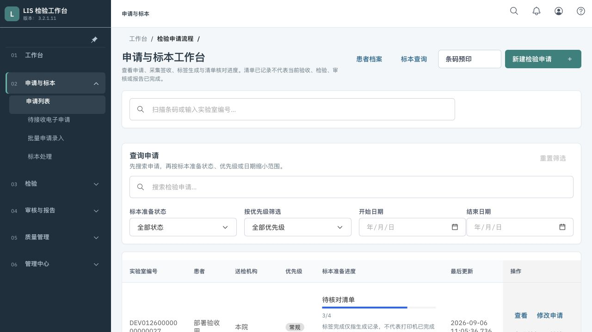
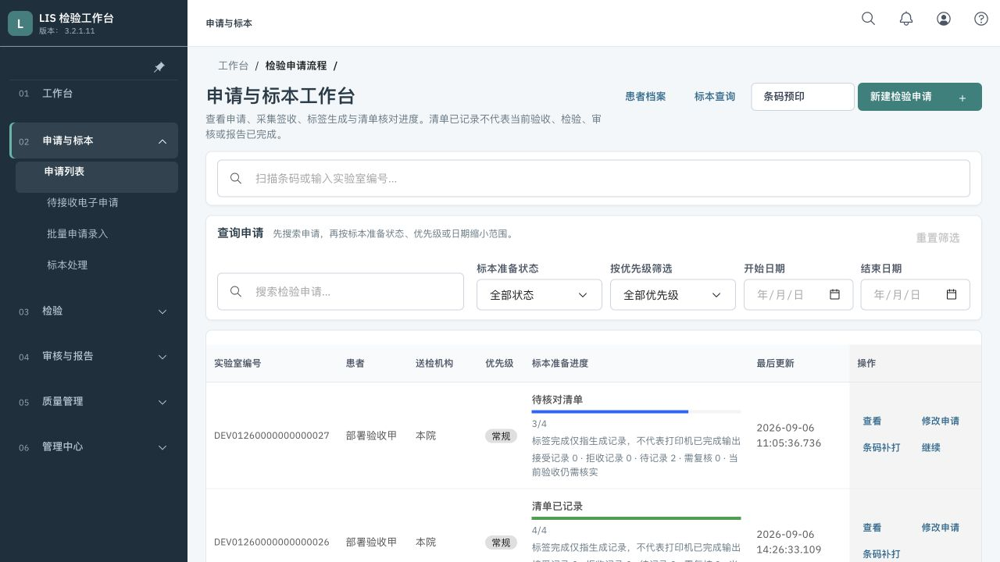
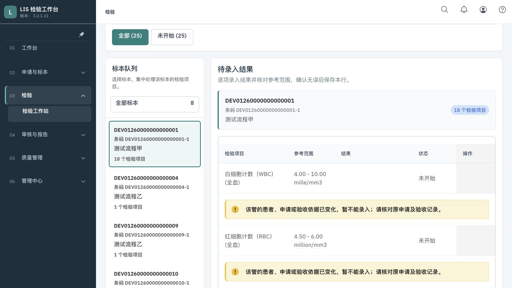
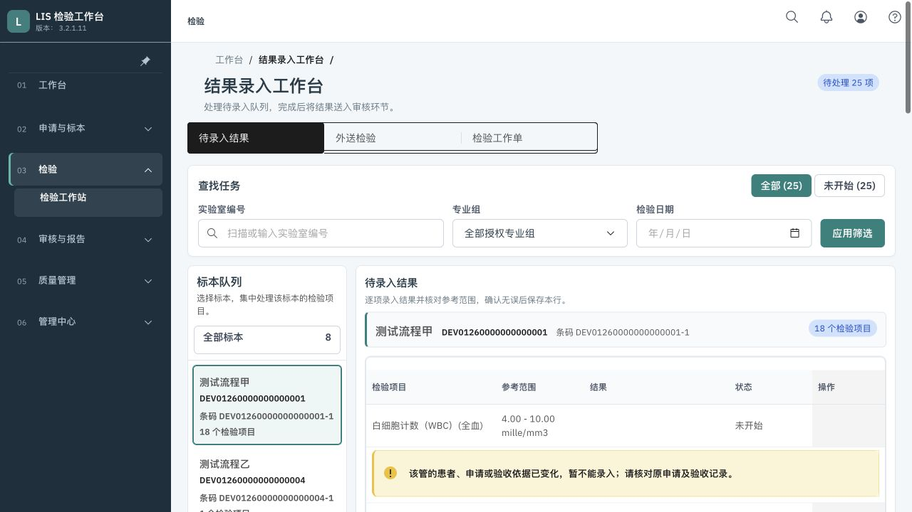

# 现有系统改造版：实际部署记录

2026-09-23。本批已部署并从真实页面核验；完整 A—E 业务改造尚未交付。固定需求、后续分工和最低验收沿用 `iteration-2026-09-23.md`、`execution-handoff-20260923.md`，不另起原型或改换系统。

## 可以访问的程序

- 申请列表：`http://127.0.0.1:18080/order`
- 结果工作台：`http://127.0.0.1:18080/Results?scope=pending`
- 现有中文手册：`http://127.0.0.1:18080/docs/china-lis-user-manual.html`
- 运行前端版本：`http://127.0.0.1:18080/delivery-version.json`

手册仍是原有版本，这一批没有重写岗位业务流程，完整 E-02 手册验收仍保留。第一次从旧标签页访问时刷新一次即可；已经实测普通刷新加载新包，不需要清除登录或草稿存储。

## 源码、提交与运行包

| 对象                  | 核实值                                                                                                                  |
| --------------------- | ----------------------------------------------------------------------------------------------------------------------- |
| 持续开发仓库          | `/Users/ld/Projects/openelis-cn-delivery`，非云盘目录，完整 Git 克隆                                                    |
| 原工作目录            | `/Users/ld/Documents/lis/openelis-cn`；索引、工作改动保留，未覆盖                                                       |
| 用户远程              | `ssh://git@ssh.github.com:443/liudong-geek/openelis-cn.git`                                                             |
| 功能分支              | `feat/017-lis-product-delivery-m1-report-foundation`                                                                    |
| 规划提交              | `d83537bb6636788b4e93d97df4f3e058008a1b81`                                                                              |
| 页面与必要工程修复    | `5726cbe8180b8ce1b6f26224e42c7a1db3a235fc`，已推送并读回                                                                |
| 缓存修复/本次运行源码 | `9498d19b20eb216c4befa8824aa16dbe0b4bab1f`，已推送并读回                                                                |
| 前端镜像              | `sha256:a556389f85716acf58168e10f3a199553ae924cf814459e059045464facb07bd`                                               |
| 主 JS                 | `index-Bydej218.js`；SHA-256 `f786932b0ee0ba15f7e2da4667e6fdca53ad796b5c371eb4a08a59d3d089f1aa`                         |
| 主 CSS                | `index-JKVUQGMt.css`；SHA-256 `e2daaeb6069e24c9bf023bd3d680a1779960827252db37804f19685d2c9d5a0e`                        |
| 源码清单              | 1,290 个受版本管理的前端输入逐文件核对；发布清单指纹 `30e97be66b9572bf89d32731d7d6228d9942f86a4ab1aca45e8b04c717e9666e` |

构建工作目录与持久仓库逐文件一致后才用于镜像。最后缓存修复只改 Nginx/镜像复制配置，复用已验证的同一 JS/CSS 产物；后续仅文档提交不会改变此运行源码版本。

## 实际验收

- 完整前端门禁：290 个文件、3,584 条测试通过，13 条既有跳过；中文关键文案及类型回归门禁通过。完整类型检查仍有 401 条历史诊断，未提高基线。
- 最后日期 CSS 独立构建并在 1200px 实际填写复测；候选页面进一步检查 1056/1024/390/1280px，七列申请字段与五列结果字段保留，横滚局限表格。390px 稳定布局中的日期宽 159.5px，可完整显示日期；即时缩窗的过渡宽度不当作最终布局证据。
- 真实候选连接原后端：申请搜索、空结果、重置、分页、只读查看；结果键盘换管与返回、患者/标本/项目同步、18 条拦截保留。详见本目录的批次验收。
- 正式 18080：普通刷新后实测加载上表新 JS/CSS，申请列表正常；结果选中 18 项管，切到 1 项管再返回，身份与项目对应，五列和 18 条拦截保留。两个最终页面控制台未记录 error。
- `/`、`/index.html`、`/login`、`/order`、结果和管理深链均返回相同新 HTML，带 `no-store, no-cache, must-revalidate`；版本清单同样禁缓存。JS/CSS 保留长期缓存，缺失指纹资源仍 404，中文手册可读取。运行 Nginx 配置与仓库逐字节一致。
- 仅替换前端，仍运行四个核心容器。后端、数据库、代理的容器 ID 和启动时间均未变；前端仍限 0.5 CPU、256 MiB。没有启动仪器、FHIR 或其他业务容器。

当前模拟数据的结果录入受历史验收依据变化/未签收限制。浏览器没有执行结果保存、审核、签发、打印或整条跨岗位写入测试。完整浏览器 E2E、后端和医院上线验收未完成，不把只读页面成功当作这些业务通过。

## 同尺寸前后截图

以下都是现有程序及明确的模拟数据，1280×720。截图用于本批布局对照，不代替功能和权限验收。

申请列表改造前：



申请列表正式部署后：



结果工作台改造前：



结果工作台正式部署后：



## 回退与证据保存

原前端镜像保留为 `openelis-cn-frontend:before-layout-20260923`，原摘要 `sha256:324f239581d05a2be30e2c3d7551193b85522263ad82370dccde91e250c86067`。本批没有改数据库，无需数据回滚。需要回退时，在上述持久仓库使用：

```sh
docker tag openelis-cn-frontend:before-layout-20260923 openelis-cn-frontend:local
docker compose --env-file .env -p openelis-cn -f docker-compose.yml -f docker-compose.cn.yml -f docker-compose.local.yml up -d --no-deps --no-build --pull never --force-recreate frontend.openelis.org
```

该目录 `.env` 只说明本地前端用途，没有配置后端/数据库环境；以上命令仅用于前端，不扩展为启动全栈的命令。

原始测试日志、源码/产物清单、前后截图、三方差异、原索引及 1,422 份可读原工作文件保存于 `/Users/ld/Projects/openelis-cn-delivery-evidence/20260923`。未读取的云占位内容仍属于未知；不宣称原工作树已全部收齐或合入。

下一项按既定顺序执行 A-02：统一有权结果队列与首页待办的范围和计数单位，区别零任务、无权和失败；再做 A-03 共同阻断说明及合法交接。完整 14 项仍保留，局部布局部署不关闭整项。
